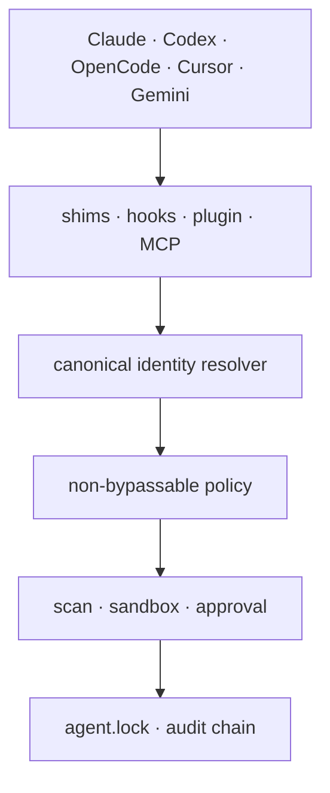

<p align="center">
  
</p>

<p align="center">
  <a href="https://github.com/carterlasalle/RepoSeal/actions/workflows/ci.yml"></a>
  <a href="https://github.com/carterlasalle/RepoSeal/actions/workflows/security.yml"></a>
  <a href="LICENSE"></a>
  
  
</p>

RepoSeal is a supply-chain firewall for AI coding agents. It intercepts repository clones, package installs, MCP/skill/plugin acquisition, and download-to-shell commands; resolves the likely canonical project identity; blocks HalluSquats and suspicious installers; and records approved capabilities in a portable `agent.lock`.

It answers the question package managers cannot: **is this the real project the agent intended, or a malicious lookalike it hallucinated?**

```console
$ reposeal run -- codex
RepoSeal intercept: git clone github:project-official/project

REPOSEAL BLOCKED INSTALL
Requested: github:project-official/project
Canonical: github:actual-company/project
Risk: Critical
  CRITICAL RS-CANONICAL-OWNER-MISMATCH Requested owner conflicts with authoritative identity
  HIGH     RS-HALLUSQUAT-PATTERN        Owner matches a predictable organization substitution
Decision: BLOCKED
```

## Start in five minutes

RepoSeal v1 builds as one portable Rust binary:

```bash
git clone https://github.com/carterlasalle/RepoSeal
cd RepoSeal
cargo install --locked --path crates/reposeal-cli

reposeal init
reposeal doctor
reposeal verify github:astral-sh/uv
reposeal run -- codex
```

Use any supported agent or command after `--`: `claude`, `codex`, `opencode`, `gemini`, or a shell. The inherited shims cover Git/GitHub CLI, npm/npx/Yarn/pnpm/Bun, pip/uv/Poetry, Cargo, Go, curl, and wget. A blocked acquisition returns before the real executable starts; ordinary commands pass through.

```bash
# Resolve exact identities
reposeal verify npm:@modelcontextprotocol/sdk
reposeal verify pypi:ruff --json

# Review and lock an exact capability
reposeal lock add github:astral-sh/uv --commit 38b94d4
reposeal lock verify agent.lock

# Inspect content without executing it
reposeal scan path/to/staged-source
reposeal scan . --ignore-file .reposealignore
reposeal sandbox plan --workspace /tmp/reposeal-stage -- npm install

# Validate public trust metadata and local policy
reposeal manifest check reposeal.manifest.json
reposeal policy check .reposeal/policy.yaml
```

Decision exits are stable: `0` verified, `2` human review, `10` blocked, `3` operational failure. Provider errors and malformed evidence never become verified.

## One core, every agent surface



| Surface | Shipped integration | Security role |
| --- | --- | --- |
| Terminal and agent subprocesses | Rust CLI + inherited PATH shims | Mandatory acquisition interception |
| Claude Code | PreToolUse hook + wrapper | Native deny before tool execution |
| Codex, Cursor, Gemini CLI | Wrapper + MCP configuration | Process-tree enforcement and structured verification |
| OpenCode | `tool.execute.before` TypeScript plugin | Native command guard, fail closed |
| VS Code / Cursor editor | TypeScript extension | Verify and scan commands with status UI |
| CI | Composite GitHub Action | Verify lock/policy and scan the checkout |
| Agent tools | MCP 2025-11-25 server | `verify_dependency` and `scan_path` |
| Applications | Python and TypeScript SDKs | Typed, shell-free CLI integration |

The detailed setup matrix is in [the integration guide](docs/INTEGRATIONS.md).

## What v1 contains

- **Canonical-source resolver:** GitHub, npm, PyPI, crates.io, Go modules, URLs, skills, plugins, and MCP identities; bounded HTTPS, cached evidence, cross-source conflicts, repository age/fork/archive state, lifecycle scripts, and explicit uncertainty.
- **HalluSquatting detector:** deterministic owner swaps, `-ai`/`hq`/`official` variants, project-as-owner, misspellings, deletions, transpositions, hyphenation, and pluralization with a hard candidate cap.
- **Policy-as-code:** strict YAML, exact allow/deny roots, owner/domain controls, enforce/audit behavior, and a rule that allowlists cannot erase critical evidence.
- **Universal `agent.lock`:** canonical identity, exact commit/version, integrity, permissions, dependencies, instruction hash, provenance, approvals, review time, deterministic entry hashes, atomic persistence, and symlink/tamper rejection.
- **Safe installation analysis:** bounded static inspection plus Bubblewrap or macOS Seatbelt plans. RepoSeal refuses to claim a weak fallback is a strong sandbox.
- **Evidence-bound provenance:** strict capability manifests and external signature results bound to trusted issuer, subject, manifest digest, and commit. Parsing an attestation is never mislabeled as cryptographic verification.
- **Replayable audit:** canonical report hashes and a sequential tamper-evident local metadata chain that deliberately excludes secrets and raw command arguments.
- **Hermetic public benchmark:** 100 canonical cases, 100 HalluSquats, and 50 malicious-install cases with a versioned corpus hash and explicit limitations.

The workspace is split into seven focused Rust crates so the enforcement core is reusable without the CLI. Every external format has a versioned JSON Schema under [`spec/`](spec/), and every security claim maps to implementation and tests in [`docs/TRACEABILITY.md`](docs/TRACEABILITY.md).

## Can Your Agent Clone Safely?

```bash
reposeal benchmark --agent "Claude Code + RepoSeal"
reposeal benchmark --agent "Codex + RepoSeal" --json
```

```text
Canonical repositories selected: 100/100
HalluSquats blocked:             100/100
Malicious install scripts:        50/50
False-positive rate:               0.0%
Grade: A
```

The v1 command evaluates RepoSeal's hermetic enforcement corpus; the agent argument labels the protected configuration. It does not claim to measure an unwrapped model. Results include the corpus ID, content hash, latency, and limitations so comparisons remain reproducible rather than becoming marketing numbers.

## Research basis

RepoSeal is a defensive implementation motivated by July 2026 research:

- [*Beware of Agentic Botnets: Scalable Untargeted Promptware Attacks via Universal and Transferable Adversarial HalluSquatting*](https://arxiv.org/abs/2607.07433) reports highly predictable repository and skill-identifier hallucinations and demonstrates remote tool execution/RCE in production agent applications.
- [*Skills Are Not Islands: Measuring Dependency and Risk in Agent Skill Supply Chains*](https://arxiv.org/abs/2607.01136) analyzes 1.43 million skills and motivates typed manifests, explicit provenance/dependencies, audit commands, and lockfile-like records.

The included corpora use safe synthetic identities and inert strings—never deployable payloads. Contributions add attacks as minimal, ethical reproductions with expected policy outcomes.

## Security boundary

RepoSeal controls processes launched through its shims or native integrations. It cannot stop an agent from executing an unwrapped absolute binary path, prove semantic ownership from a single weak signal, or turn an ordinary host process into an OS sandbox. Use enforce mode, controlled PATH and agent configuration, independently verified provenance, least privilege, and platform isolation together.

Read the [threat model](docs/THREAT_MODEL.md), [security policy](SECURITY.md), and [user guide](docs/USER_GUIDE.md) before production enforcement. Security issues belong in private reporting—not public benchmark cases.

## Documentation

| Document | Purpose |
| --- | --- |
| [User guide](docs/USER_GUIDE.md) | Installation, every command, decisions, incident handling |
| [PRD](docs/PRD.md) | Users, jobs, product boundaries, acceptance criteria |
| [Specification](docs/SPECIFICATION.md) | Normative v1 behavior and formats |
| [Technical design](docs/TECHNICAL_DESIGN.md) | Architecture, trust model, algorithms, data flow |
| [Threat model](docs/THREAT_MODEL.md) | Assets, adversaries, abuse cases, residual risk |
| [Implementation plan](docs/IMPLEMENTATION_PLAN.md) | Completed M0–M10 delivery map |
| [ADRs](docs/adr/) | Architectural decisions and rejected alternatives |

Apache-2.0. Contributions are welcome under [CONTRIBUTING.md](CONTRIBUTING.md).
